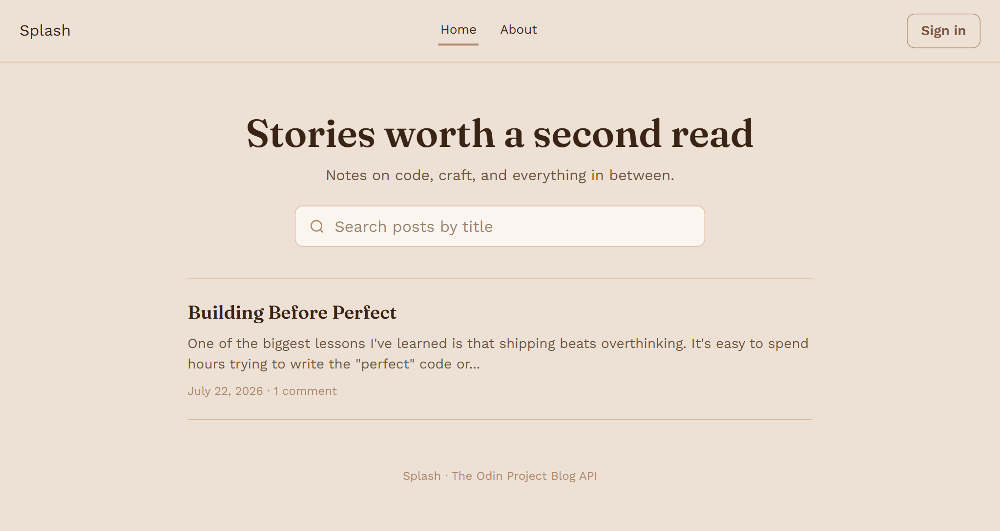
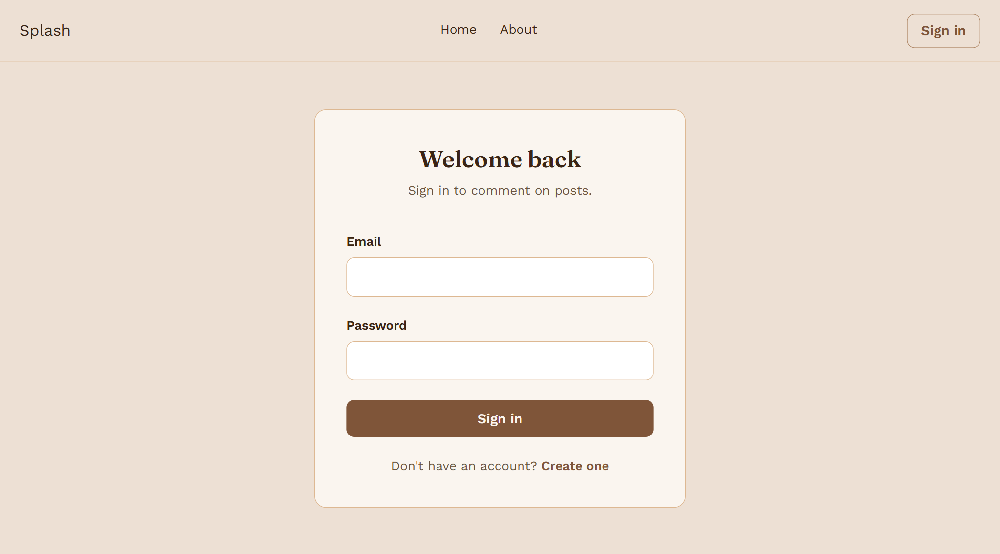
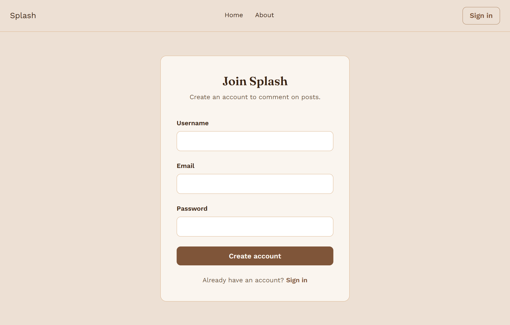
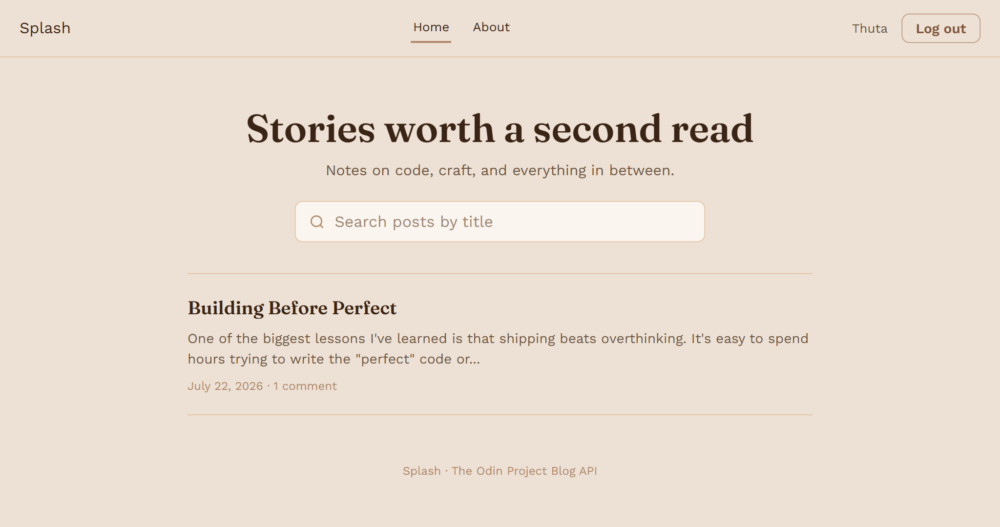
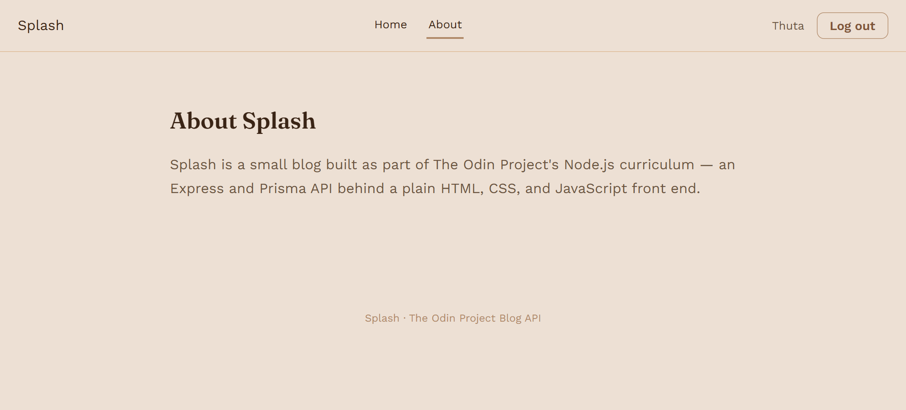
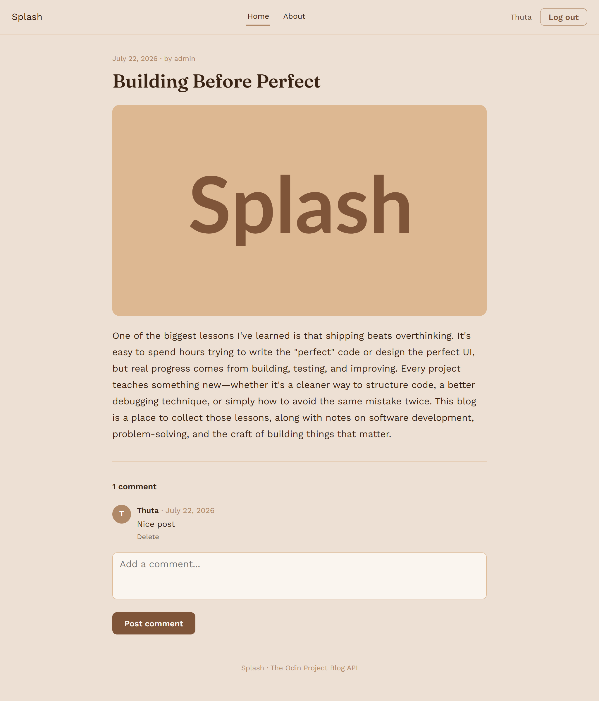
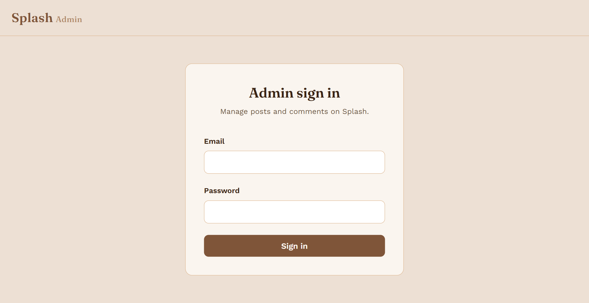
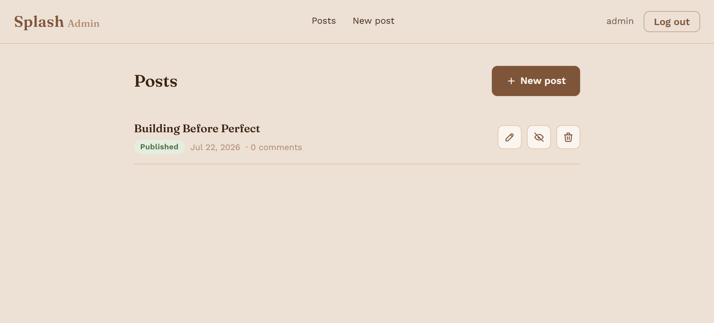
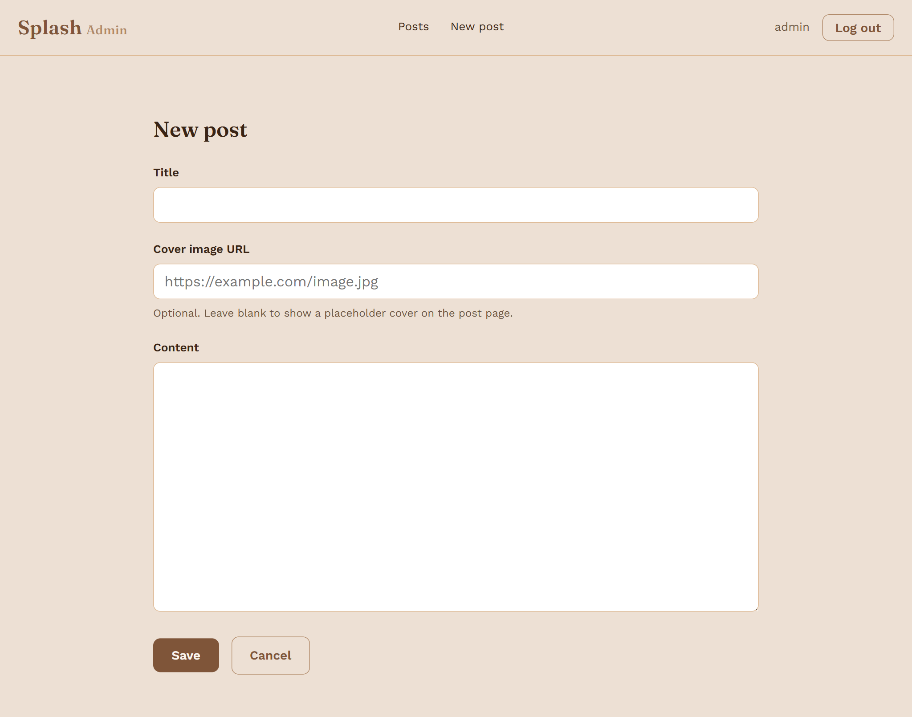
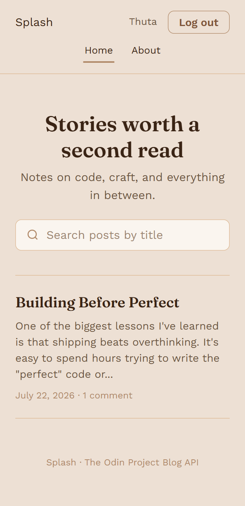

# Splash

A full-stack blog built for [The Odin Project](https://www.theodinproject.com/)'s Blog API project — a REST API backend paired with two separate static frontends: a public blog and an author dashboard.



<!-- [](https://threadvault-inventory.onrender.com) -->
[](https://github.com/Matthew1835/splash-blog)

---

## Table of Contents

- [About](#about)
- [Pages](#pages)
- [Features](#features)
- [Tech Stack](#tech-stack)
- [Installation](#installation)
- [Usage](#usage)
- [Screenshots](#screenshots)
- [Project Structure](#project-structure)
- [Additional Features](#additional-features) 

---

## About

Splash is split into three independent pieces that only communicate over HTTP:

- **`api/`** — an Express + Prisma REST API (PostgreSQL) that serves JSON only, with JWT-based authentication.
- **`blog/`** — the public-facing site where visitors read posts, search by title, and comment if they're signed in.
- **`admin/`** — a separate dashboard, restricted to admin accounts, for writing, editing, publishing, and moderating comments.

Both frontends are plain HTML, CSS, and vanilla JavaScript (ES modules) — no framework, no build step. They consume the API the same way any external client would.

---

## Pages

**Blog**
| Page | Path | Description |
|------|------|-------------|
| Home | `index.html` | Hero with title search, list of published posts |
| Post detail | `post.html?id=<id>` | Full post, cover image, comments |
| Sign in | `login.html` | Reader login |
| Register | `register.html` | Create a reader account |
| About | `about.html` | About the project |

**Admin**
| Page | Path | Description |
|------|------|-------------|
| Dashboard | `index.html` | All posts (published + draft), publish/unpublish, edit, delete |
| Post form | `post-form.html` / `post-form.html?id=<id>` | Create or edit a post; comment moderation when editing |
| Sign in | `login.html` | Admin-only login |

---

## Features

- JWT authentication (stateless, `Authorization: Bearer` header, no server-side sessions)
- Role-based access: `ADMIN` (author/moderator) vs `USER` (reader)
- Published vs draft posts — drafts are only visible to a logged-in admin
- Search posts by title on the homepage
- Comments require a logged-in account; usernames shown on every comment
- Comment ownership enforced server-side — a reader can delete their own comment, an admin can delete any
- Publish/unpublish toggle and full CRUD on posts from the admin dashboard
- Inline comment moderation on the post edit page
- Mobile-first, responsive layout throughout

---

## Tech Stack

**Backend**
- Node.js, Express
- Prisma 7 (PostgreSQL via `@prisma/adapter-pg`)
- Passport (JWT strategy), `jsonwebtoken`, `bcryptjs`

**Frontend** (`blog/` and `admin/`)
- Plain HTML5 / CSS3
- Vanilla JavaScript (ES modules), `fetch` for all API calls
- No frameworks, no bundler, no build step

---

## Installation

**1. Clone and set up the database**

Create a local PostgreSQL database (or run one via Docker):
```bash
docker run --name splash-db -e POSTGRES_PASSWORD=postgres -p 5432:5432 -d postgres
psql -U postgres -c "CREATE DATABASE splash_db;"
```

**2. API**
```bash
cd api
npm install
cp .env.example .env   # set DATABASE_URL and a real JWT_SECRET
npx prisma generate
npx prisma migrate dev --name init
npx prisma db seed      # creates admin@splash.dev / admin1234
npm run dev             # http://localhost:3000
```

**3. Blog and Admin**

No install needed — both are static files. Serve each with any static file server, for example Python's built-in one:
```bash
cd blog
python3 -m http.server 5175
```
```bash
cd admin
python3 -m http.server 5176
```

Update `api/.env` so `CLIENT_URL` and `ADMIN_URL` match whatever ports you actually used, then restart the API.

---

## Usage

1. Open the admin dashboard and sign in with the seeded admin account.
2. Click **New post**, write a title and content, save, then **Publish**.
3. Open the blog — the post appears on the homepage and is searchable by title.
4. Register a reader account on the blog, sign in, and leave a comment on the post.
5. Back in admin, open that post's edit page to see and moderate its comments.

---

## Screenshots

| Login | Register |
|-------|----------|
|  |  |

| Home | About |
|------|-------|
|  |  |

| Post Detail | Admin Login  |
|-------------|--------------|
|  |  |

| Admin Dashboard | Post Form |
|-----------------|-----------|
|  |  |

| Mobile |
|--------|
|  |

---

## Project Structure

```
splash-blog/
├── api/
│   ├── prisma/
│   │   ├── schema.prisma
│   │   └── seed.js
│   ├── prisma.config.mjs
│   └── src/
│       ├── app.js
│       ├── server.js
│       ├── config/passport.js
│       ├── controllers/
│       ├── middleware/
│       ├── routes/
│       └── lib/prisma.js
├── blog/
│   ├── index.html
│   ├── post.html
│   ├── login.html
│   ├── register.html
│   ├── about.html
│   ├── css/styles.css
│   └── js/
└── admin/
    ├── index.html
    ├── post-form.html
    ├── login.html
    ├── css/styles.css
    └── js/
```

---

## Additional Features

Beyond the base project spec:
- Live title search on the homepage (debounced)
- Publish/unpublish toggle, independent of edit/save
- Comment moderation surfaced directly on the post edit page, rather than a separate view
- `optionalAuth` middleware so a single `GET /api/posts` endpoint serves both anonymous visitors and the admin dashboard, returning different data depending on who's asking

Ideas not yet built: real image uploads (currently a URL field with a placeholder fallback), pagination for large post lists, tags/categories.

---

## Contact

**Myat Thuta (Matthew)**
- Portfolio: *https://matthew1835.github.io/my-portfolio/*
- LinkedIn: *https://www.linkedin.com/in/myat-thuta-26051a273/*
- Email: *myatthuta1835@gmail.com*
- GitHub: [@Matthew1835](https://github.com/Matthew1835)

---

## License

This project is open source and available under the [MIT License](LICENSE).

---

*⭐ If you found this project interesting, feel free to star the repo!*